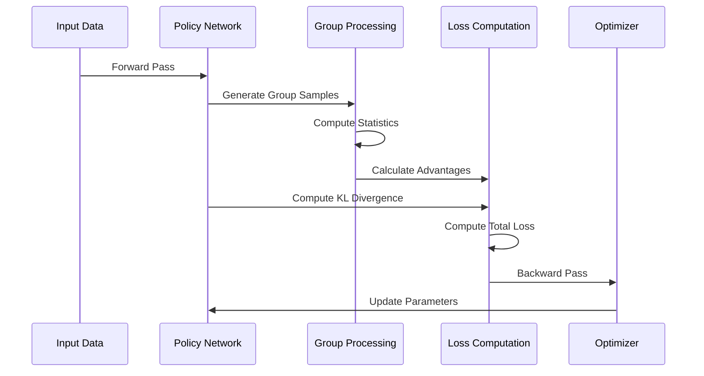

# Open Implemenation of Deepseek's R1

[](https://discord.gg/agora-999382051935506503) [](https://www.youtube.com/@kyegomez3242) [](https://www.linkedin.com/in/kye-g-38759a207/) [](https://x.com/kyegomezb)


## Installation

```bash
pip install openr1
```

## Usage

```python


import torch
from torch import nn
from openr1 import GRPO

# Simple po`licy network
class PolicyNet(nn.Module):
    def __init__(self, input_dim=10, hidden_dim=64, output_dim=2):
        super().__init__()
        self.net = nn.Sequential(
            nn.Linear(input_dim, hidden_dim),
            nn.ReLU(),
            nn.Linear(hidden_dim, output_dim),
            nn.Softmax(dim=-1)
        )
    
    def forward(self, x):
        return self.net(x)

# Initialize components
policy = PolicyNet()
grpo = GRPO(policy=policy)

# Create dummy batch
batch_size = 32
states = torch.randn(batch_size, 10)  # 10 is input_dim
actions = torch.randint(0, 2, (batch_size,))  # Binary actions
rewards = torch.randn(batch_size)
group_indices = torch.arange(batch_size) // grpo.config.group_size
old_probs = torch.softmax(torch.randn(batch_size, 2), dim=-1)

# Update policy
metrics = grpo.update(states, actions, rewards, group_indices, old_probs)
print(f"Training metrics: {metrics}")

# Sample new actions
states = torch.randn(4, 10)  # 4 new states
actions, probs = grpo.sample_actions(states, num_samples=3)
print(f"Sampled actions shape: {actions.shape}")  # [4, 3]
print(f"Action probabilities shape: {probs.shape}")  # [4, 3, 2]
```


## Diagram


